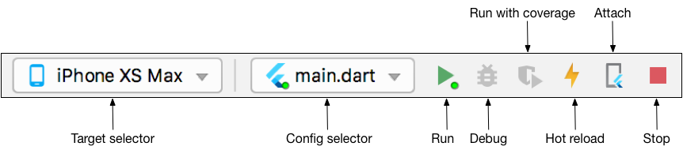
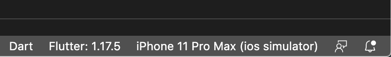

# green_kharkiv

test project

## Getting Started

1. [Download Flutter](https://storage.googleapis.com/flutter_infra_release/releases/stable/windows/flutter_windows_2.8.1-stable.zip) or git clone https://github.com/flutter/flutter.git -b stable
 !!! Do not install Flutter in a directory like C:\Program Files\ that requires elevated privileges !!!
 example -> C:\Users\<your-user-name>\Documents
2. Add full path to flutter\bin to PATH. You may need to restart your computer.
3. Run command `C:\src\flutter>flutter doctor`
4. Download and install [Android Studio](https://developer.android.com/studio).
5. Start Android Studio, and go through the [Android Studio Setup Wizard](https://developer.android.com/studio/install). This installs the latest Android SDK, Android SDK Command-line Tools, and Android SDK Build-Tools, which are required by Flutter when developing for Android.
6. Run flutter doctor to confirm that Flutter has located your installation of Android Studio. If Flutter cannot locate it, run flutter config --android-studio-dir <directory> to set the directory that Android Studio is installed to.
7. Launch Android Studio, click the AVD Manager icon, and select Create Virtual Device…
   - In older versions of Android Studio, you should instead launch Android Studio > Tools > Android > AVD Manager and select Create Virtual Device…. (The Android submenu is only present when inside an Android project.)
   - If you do not have a project open, you can choose Configure > AVD Manager and select Create Virtual Device…
8. Choose a device definition and select Next.
9. Select one or more system images for the Android versions you want to emulate, and select Next. An x86 or x86_64 image is recommended.
10. Make sure that you have a version of Java 8 installed and that your JAVA_HOME environment variable is set to the JDK’s folder.
    Android Studio versions 2.2 and higher come with a JDK, so this should already be done.
11. Open an elevated console window and run the following command to begin signing licenses.
    `flutter doctor --android-licenses`
    `flutter config --enable-windows-desktop`
    `flutter channel dev`
    `flutter upgrade`
    `flutter config --enable-windows-uwp-desktop`

## Android Studio

Install the Flutter and Dart plugins

1. Open plugin preferences (File > Settings > Plugins).
2. Select Marketplace, select the Flutter plugin and click Install.

### Run the app
1. Locate the main Android Studio toolbar:

2. In the target selector, select an Android device for running the app. If none are listed as available, select Tools > AVD Manager and create one there. For details, see [Managing AVDs](https://developer.android.com/studio/run/managing-avds).
3. Click the run icon in the toolbar, or invoke the menu item Run > Run.

## VS Code

Install the Flutter and Dart plugins

1. Start VS Code.
2. Invoke View > Command Palette….
3. Type “install”, and select Extensions: Install Extensions.
4. Type “flutter” in the extensions search field, select Flutter in the list, and click Install. This also installs the required Dart plugin.

Validate your setup with the Flutter Doctor

1. Invoke View > Command Palette….
2. Type “doctor”, and select the Flutter: Run Flutter Doctor.
3. Review the output in the OUTPUT pane for any issues. Make sure to select Flutter from the dropdown in the different Output Options.

### Run the app
1. Locate the VS Code status bar (the blue bar at the bottom of the window):

2. Select a device from the Device Selector area. For details, see [Quickly switching between Flutter devices](https://dartcode.org/docs/quickly-switching-between-flutter-devices).
   - If no device is available and you want to use a device simulator, click No Devices and launch a simulator.
   `open -a simulator`
   - To setup a real device, follow the device-specific instructions on the [Install](https://docs.flutter.dev/get-started/install) page for your OS.
3. Invoke Run > Start Debugging or press F5.
4. Wait for the app to launch — progress is printed in the Debug Console view
